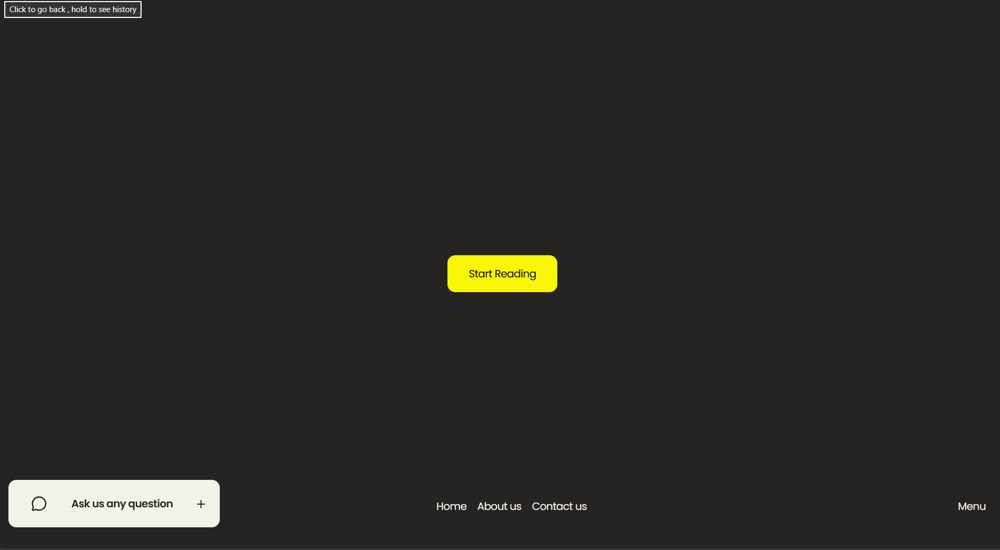
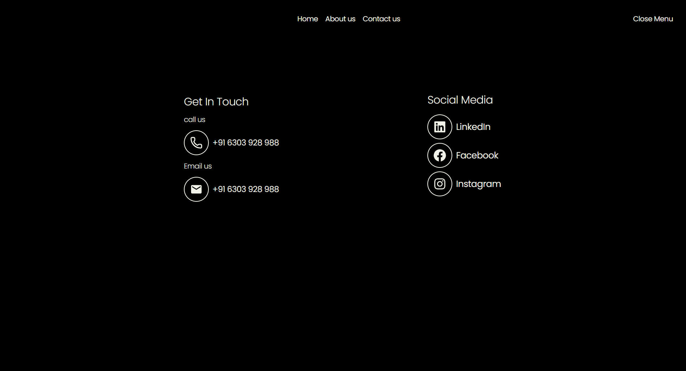
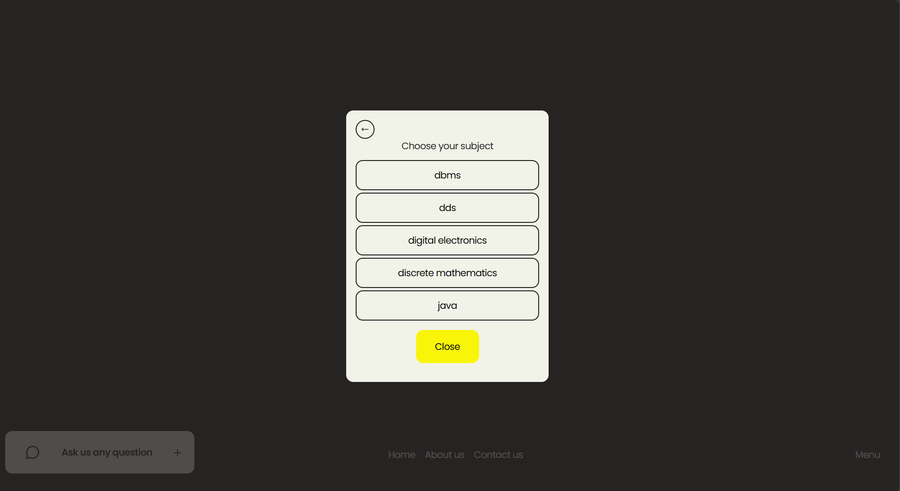
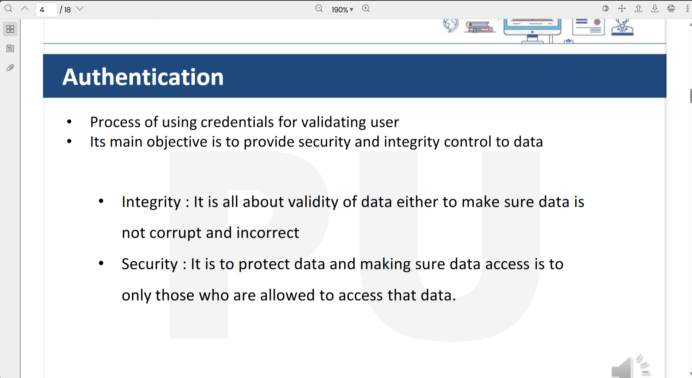

# 🎓 STUDENTIST – Your Smart Academic Companion  

> **"Because learning should be effortless, not endless searching."**  

 <!-- Optional: Replace with your own banner -->

---

## 🌟 Overview  

**STUDENTIST** is a modern, intelligent web application built for **Parul University students** to easily access, browse, and download academic resources like **lecture notes, PDFs, and syllabi** — all in one sleek platform.  

Designed with **React**, powered by a **Node.js + Express backend**, and securely integrated with **Firebase Storage**, STUDENTIST provides a **native, fast, and distraction-free** academic experience.  

---

## 🚀 Features  

- 📚 **Semester & Subject-Based Navigation** – Organized, intuitive browsing by year and semester.  
- ☁️ **Cloud-Backed File Access** – Firebase Storage ensures fast and secure access.  
- ⚡ **Native App Feel** – Smooth animations, minimal lag, and modern UX.  
- 🔒 **Secure & Scalable Backend** – Node.js + Express architecture for performance.  
- 💡 **Minimalist Yet Powerful UI** – Clean, clutter-free, and focused.  

---

## 🛠️ Tech Stack  

| Category | Technology |
|-----------|-------------|
| **Frontend** | React (Vite), Tailwind CSS |
| **Backend** | Node.js, Express.js |
| **Database** | MongoDB |
| **Storage** | Firebase Cloud Storage |
| **Deployment** | Netlify |
| **Version Control** | Git & GitHub |

---

## 🧭 Folder Structure  

```
STUDENTIST_APP/
├── node_modules/
├── public/
│ └── menu_bg.svpngg
├── src/
│ ├── assets/
│ ├── components/
│ │ └── DialogBox/
│ │ ├── DialogBox.jsx
│ │ └── dialogSlice.js
│ ├── constants/
│ │ └── steps.js
│ ├── data/
│ ├── hooks/
│ │ ├── useFetchNotes.jsx
│ │ └── useSteps.jsx
│ ├── sections/
│ │ ├── Home/
│ │ │ ├── Home.jsx
│ │ │ ├── homeSlice.js
│ │ │ └── selectionSlice.js
│ │ ├── Menu/
│ │ │ ├── Menu.jsx
│ │ │ └── menuSlice.js
│ │ └── PdfReader/
│ │ └── PdfReader.jsx
│ ├── Store/
│ │ └── store.js
│ ├── App.jsx
│ ├── index.css
│ ├── main.jsx
│ └── vite.config.js
├── .gitignore
├── package.json
├── package-lock.json
├── tailwind.config.js
└── README.md
```


---

## ⚙️ Getting Started  

### 1️⃣ Clone the Repository  
```bash
git clone https://github.com/ABUBAKAR-DAHIR/STUDENTIST_APP.git
cd STUDENTIST_APP
```
### 2️⃣ Install Dependencies
```bash
npm install
```
### 3️⃣ Run the Development Server

```bash
npm run dev
```
Open 👉 http://localhost:5173

# 🧠 Architecture Highlights

- **Reusable Components:** `DialogBox`, `Menu`, and `PdfReader` handle modular UI logic.  
- **Custom Hooks:** `useFetchNotes` and `useSteps` simplify API & navigation logic.  
- **Redux Slices:** Each screen (`Home`, `Menu`, `Dialog`) manages its own state slice.  
- **Scalable Design:** Future-ready for adding backend integration or authentication.  

---


# 📸 UI Sneak Peek

### Step Navigation


### Menu Page


### Selection


### PDF Reading



# 👨‍💻 Author

**Abubakar Dahir**  
B.Tech CSE | BA Mathematics | Developer & Visionary  

- 🌐 [GitHub](https://github.com/abubakar-dahir)  
- 💼 [LinkedIn](https://www.linkedin.com/in/yourlink)  
- 📧 Email: abu112abu112abu112@gmail.com  

---

# 🧾 License

This project is licensed under the **MIT License** – free to use and modify, with proper credit.  

---

# ⭐ Support

If you like this project, please consider giving it a ⭐ star on GitHub —  
it keeps me motivated to make **STUDENTIST** even smarter and better for everyone.  

Smart Students use **STUDENTIST**. 🚀

